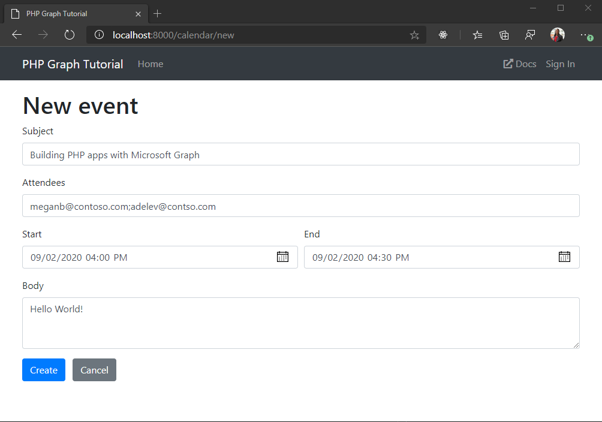

<!-- markdownlint-disable MD002 MD041 -->

<span data-ttu-id="cf202-101">В этом разделе мы добавим возможность создания событий в календаре пользователя.</span><span class="sxs-lookup"><span data-stu-id="cf202-101">In this section you will add the ability to create events on the user's calendar.</span></span>

## <a name="create-new-event-form"></a><span data-ttu-id="cf202-102">Форма создания нового события</span><span class="sxs-lookup"><span data-stu-id="cf202-102">Create new event form</span></span>

1. <span data-ttu-id="cf202-103">Создайте новый файл в каталоге **./ресаурцес/виевс** `newevent.blade.php` и добавьте указанный ниже код.</span><span class="sxs-lookup"><span data-stu-id="cf202-103">Create a new file in the **./resources/views** directory named `newevent.blade.php` and add the following code.</span></span>

    :::code language="php" source="../demo/graph-tutorial/resources/views/newevent.blade.php" id="NewEventFormSnippet":::

## <a name="add-controller-actions"></a><span data-ttu-id="cf202-104">Добавление действий контроллера</span><span class="sxs-lookup"><span data-stu-id="cf202-104">Add controller actions</span></span>

1. <span data-ttu-id="cf202-105">Откройте **./АПП/хттп/контроллерс/календарконтроллер.ФП** и добавьте приведенную ниже функцию, чтобы отобразить форму.</span><span class="sxs-lookup"><span data-stu-id="cf202-105">Open **./app/Http/Controllers/CalendarController.php** and add the following function to render the form.</span></span>

    :::code language="php" source="../demo/graph-tutorial/app/Http/Controllers/CalendarController.php" id="getNewEventFormSnippet":::

1. <span data-ttu-id="cf202-106">Добавьте следующую функцию для получения данных формы при отсылке пользователя и создания нового события в календаре пользователя.</span><span class="sxs-lookup"><span data-stu-id="cf202-106">Add the following function to receive the form data when the user's submits, and create a new event on the user's calendar.</span></span>

    :::code language="php" source="../demo/graph-tutorial/app/Http/Controllers/CalendarController.php" id="createNewEventSnippet":::

    <span data-ttu-id="cf202-107">Рассмотрите, что делает этот код.</span><span class="sxs-lookup"><span data-stu-id="cf202-107">Consider what this code does.</span></span>

    - <span data-ttu-id="cf202-108">Он преобразует входные данные участников в массив объектов [участников](https://docs.microsoft.com/graph/api/resources/attendee?view=graph-rest-1.0) графа.</span><span class="sxs-lookup"><span data-stu-id="cf202-108">It converts the attendees field input to an array of Graph [attendee](https://docs.microsoft.com/graph/api/resources/attendee?view=graph-rest-1.0) objects.</span></span>
    - <span data-ttu-id="cf202-109">Он создает [событие](https://docs.microsoft.com/graph/api/resources/event?view=graph-rest-1.0) из ввода формы.</span><span class="sxs-lookup"><span data-stu-id="cf202-109">It builds an [event](https://docs.microsoft.com/graph/api/resources/event?view=graph-rest-1.0) from the form input.</span></span>
    - <span data-ttu-id="cf202-110">Он отправляет сообщение на `/me/events` конечную точку, а затем перенаправляет обратно в представление календаря.</span><span class="sxs-lookup"><span data-stu-id="cf202-110">It sends a POST to the `/me/events` endpoint, then redirects back to the calendar view.</span></span>

1. <span data-ttu-id="cf202-111">Обновите маршруты в файле **./раутес/веб.ФП** , чтобы добавить маршруты для новых функций на контроллере.</span><span class="sxs-lookup"><span data-stu-id="cf202-111">Update the routes in **./routes/web.php** to add routes for these new functions on the controller.</span></span>

    ```php
    Route::get('/calendar/new', 'CalendarController@getNewEventForm');
    Route::post('/calendar/new', 'CalendarController@createNewEvent');
    ```

1. <span data-ttu-id="cf202-112">Сохраните все изменения и перезапустите сервер.</span><span class="sxs-lookup"><span data-stu-id="cf202-112">Save all of your changes and restart the server.</span></span> <span data-ttu-id="cf202-113">Используйте кнопку **создать событие** , чтобы перейти к форме создания события.</span><span class="sxs-lookup"><span data-stu-id="cf202-113">Use the **New event** button to navigate to the new event form.</span></span>

1. <span data-ttu-id="cf202-114">Заполните значения в форме.</span><span class="sxs-lookup"><span data-stu-id="cf202-114">Fill in the values on the form.</span></span> <span data-ttu-id="cf202-115">Использовать дату начала текущей недели.</span><span class="sxs-lookup"><span data-stu-id="cf202-115">Use a start date from the current week.</span></span> <span data-ttu-id="cf202-116">Нажмите **Создать**.</span><span class="sxs-lookup"><span data-stu-id="cf202-116">Select **Create**.</span></span>

    

1. <span data-ttu-id="cf202-118">Когда приложение перенаправляется в представление календаря, убедитесь, что новое событие присутствует в результатах.</span><span class="sxs-lookup"><span data-stu-id="cf202-118">When the app redirects to the calendar view, verify that your new event is present in the results.</span></span>
