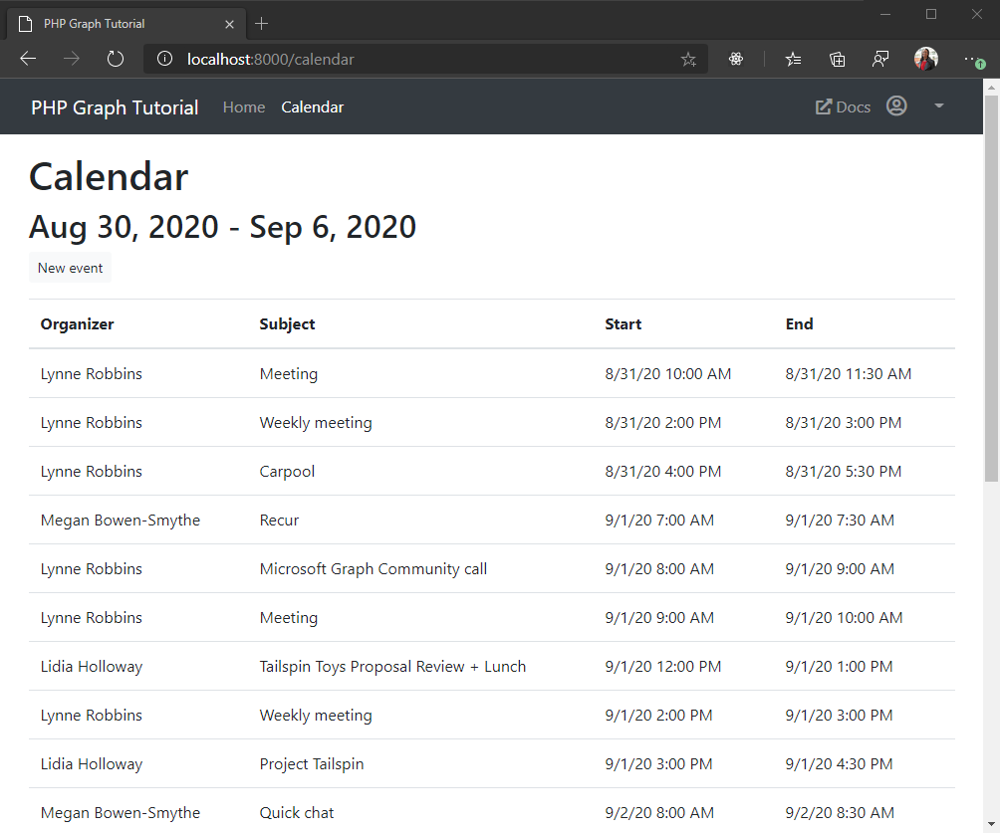

<!-- markdownlint-disable MD002 MD041 -->

В этом упражнении вы добавите Microsoft Graph в приложение. Для этого приложения вы будете использовать библиотеку [Microsoft Graph](https://github.com/microsoftgraph/msgraph-sdk-php) , чтобы совершать вызовы в Microsoft Graph.

## <a name="get-calendar-events-from-outlook"></a>Получение событий календаря из Outlook

Для начала добавим контроллер для представления календаря. Создайте новый файл в `./app/Http/Controllers` папке с именем `CalendarController.php`и добавьте приведенный ниже код.

```php
<?php

namespace App\Http\Controllers;

use App\Http\Controllers\Controller;
use Illuminate\Http\Request;
use Microsoft\Graph\Graph;
use Microsoft\Graph\Model;
use App\TokenStore\TokenCache;

class CalendarController extends Controller
{
  public function calendar()
  {
    $viewData = $this->loadViewData();

    // Get the access token from the cache
    $tokenCache = new TokenCache();
    $accessToken = $tokenCache->getAccessToken();

    // Create a Graph client
    $graph = new Graph();
    $graph->setAccessToken($accessToken);

    $queryParams = array(
      '$select' => 'subject,organizer,start,end',
      '$orderby' => 'createdDateTime DESC'
    );

    // Append query parameters to the '/me/events' url
    $getEventsUrl = '/me/events?'.http_build_query($queryParams);

    $events = $graph->createRequest('GET', $getEventsUrl)
      ->setReturnType(Model\Event::class)
      ->execute();

    return response()->json($events);
  }
}
```

Рассмотрите, что делает этот код.

- URL-адрес, который будет вызываться — это `/v1.0/me/events`.
- `$select` Параметр позволяет ограничить поля, возвращаемые для каждого события, только теми, которые будут реально использоваться представлением.
- `$orderby` Параметр сортирует результаты по дате и времени создания, начиная с самого последнего элемента.

Обновление маршрутов в `./routes/web.php` Добавление маршрута к этому новому контроллеру

```php
Route::get('/calendar', 'CalendarController@calendar');
```

Теперь вы можете протестировать это. Войдите и щелкните ссылку **Календарь** на панели навигации. Если все работает, вы должны увидеть дамп событий JSON в календаре пользователя.

## <a name="display-the-results"></a>Отображение результатов

Теперь вы можете добавить представление для отображения результатов более удобным для пользователя способом. Создайте новый файл в `./resources/views` каталоге `calendar.blade.php` и добавьте указанный ниже код.

```php
@extends('layout')

@section('content')
<h1>Calendar</h1>
<table class="table">
  <thead>
    <tr>
      <th scope="col">Organizer</th>
      <th scope="col">Subject</th>
      <th scope="col">Start</th>
      <th scope="col">End</th>
    </tr>
  </thead>
  <tbody>
    @isset($events)
      @foreach($events as $event)
        <tr>
          <td>{{ $event->getOrganizer()->getEmailAddress()->getName() }}</td>
          <td>{{ $event->getSubject() }}</td>
          <td>{{ \Carbon\Carbon::parse($event->getStart()->getDateTime())->format('n/j/y g:i A') }}</td>
          <td>{{ \Carbon\Carbon::parse($event->getEnd()->getDateTime())->format('n/j/y g:i A') }}</td>
        </tr>
      @endforeach
    @endif
  </tbody>
</table>
@endsection
```

Это приведет к перебору коллекции событий и добавлению строки таблицы для каждой из них. Удалите `return response()->json($events);` строку из `calendar` действия в `./app/Http/Controllers/CalendarController.php`и замените ее на приведенный ниже код.

```php
$viewData['events'] = $events;
return view('calendar', $viewData);
```

Обновите страницу, после чего приложение должно отобразить таблицу событий.

